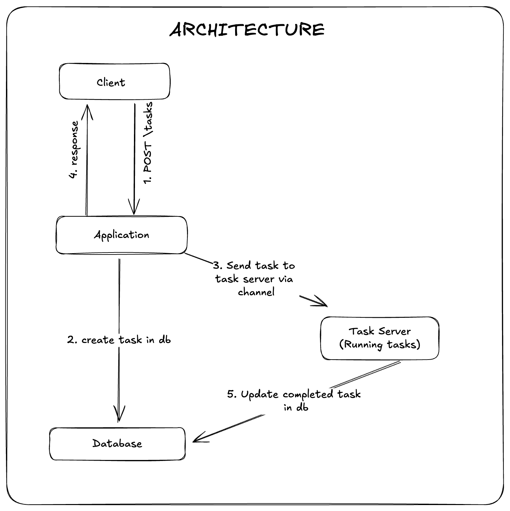

# Go Task

## Description

A simple REST API that simulates a long running task, using channels and goroutines.

## Running Program

`cd` into the cmd sub directory and run `go run .`

> [!NOTE]
> By default, program runs on port `4000`, creates sqlite3 db file `data.db` and long performing tasks take `30s`.
> You can pass in flags `--port`, `--dbName`, `taskTime` when running to change them
> Example:
>
> ```sh
> go run . --port 8000 --dbName data.db --taskTime 10
> ```

## Running Go tests

Run `go test ./...` from the root directory or `go test` from the cmd directory

> [!NOTE] > `go test` creates another sqlite3 db, `test.db`, used for testing.

## Testing API Endpoints

### Get Token

```sh
curl --request POST \
  --url http://localhost:4000/token \
  --header 'Content-Type: application/json' \
  --data '{
  "username": "admin",
  "password": "password"
}'
```

### Create Task

```sh
curl --request POST \
  --url http://localhost:4000/tasks \
  --header 'Authorization: Bearer {{token}}' \
  --header 'Content-Type: application/json' \
  --data '{"input": 6}'
```

### Get Task

```sh
curl --request GET \
  --url http://localhost:4000/tasks/{{taskID}} \
  --header 'Authorization: Bearer {{token}}'
```

## Architecture


